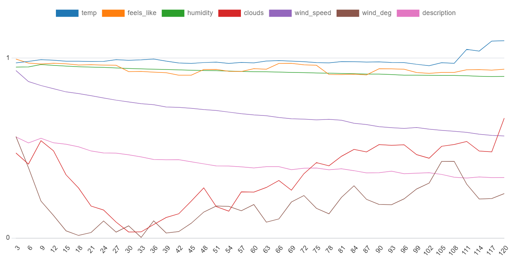
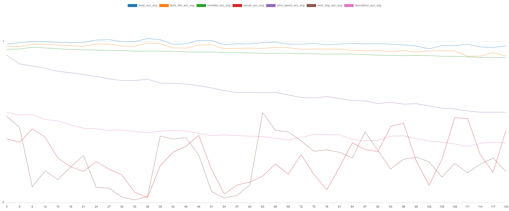
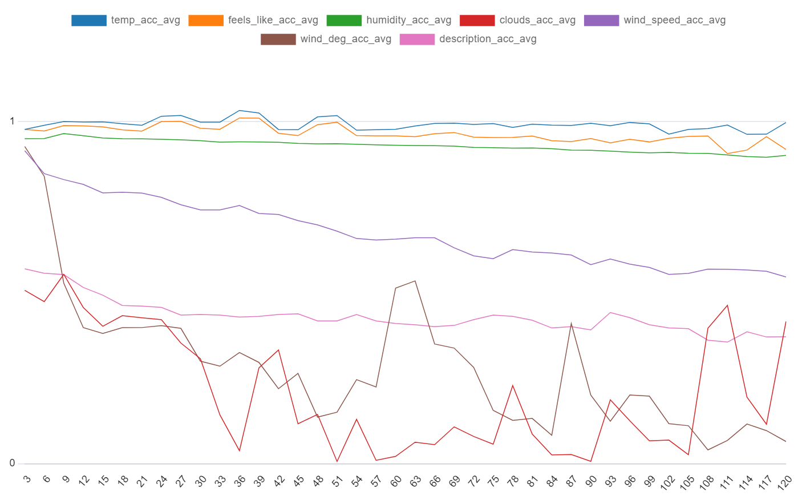
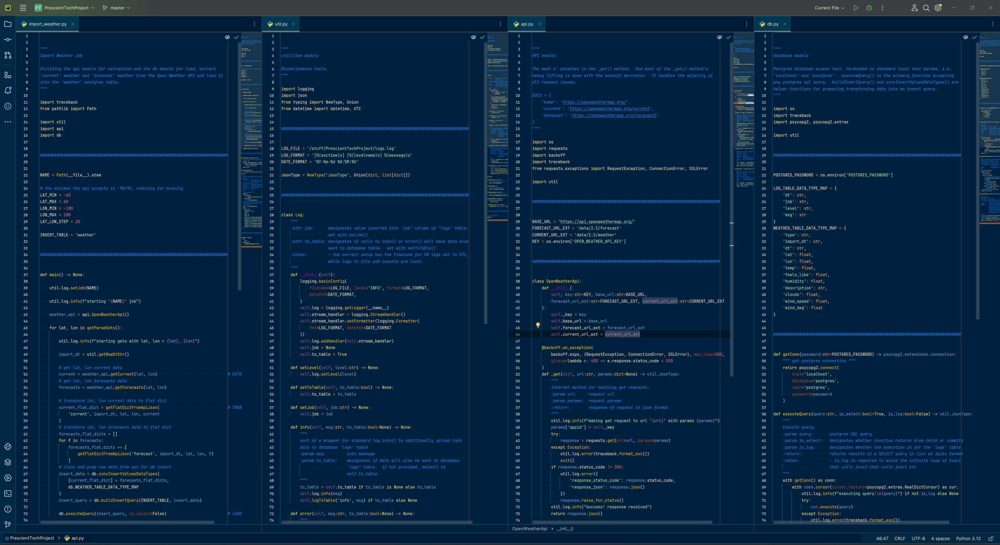

# Prescient AI Technical Assessment Project
\
**Overview:**\
\
With use of OpenWeather's API (https://openweathermap.org/) and PostgreSQL, the objective is to calculate the accuracy of data from OpenWeather's Forecast Weather endpoint, by comparing it to data from their Current Weather endpoint.\
\
\
\
**Expectation of Findings:**\
\
It is expected to see a trend of a decrease in accuracy the further out (more forecast hours) the forecast.  It is also expected to see a difference in accuracy comparing the different values.  Interested in seeing which are more accurate.\
\
\
\
**Findings:**\
\
\
X axis = forecast hours\
Y axis = accuracy (percentage)\
lines = Represent each of the 7 data values whose accuracy is being calculated.\
\
\
\
**TODOS:**\
\
The '{}_acc' columns in 'forecast_accuracy' need work.  The current pattern for normalizing the accuracy values works good until I have data values that cross 0.0.  Example:  There is an incident where current_temp is -0.36 and forecast_temp is 4.8.  This gives an accuracy of 15.33.  All accuracies should be between 0.0 and 1.0.\
\
Need to update the 'wind_deg_acc' column in 'forecast_accuracy' to account for "wrap around" data.  Example:  If forecast_wind_deg = 355 and current_wind_deg = 5 the difference should be 10.  But instead the current setup results in 350.  This is why under the current conditions, 'wind_deg_acc' has an additional layer of inaccuracy due to pipeline design, not due to data itself.\
\
Add monitoring alerts.  Under the current stack, I think the best implementation of monitoring alerts would be an 'alerts_job'.  With scalability in mind, add a job for alerts monitoring, each 'alert' is a SQL query that returns "issues" or "concerns" that we are monitoring for.  Such as add a monitoring query to return all "error" level logs since the last alert check.\
\
Add additional layers of analysis between 'forecast_accuracy' and 'forecast_accuracy_full_agg'.  We see the end results of the values accuracy, now we want to see if we can make any determinations or understandings on why.  To do this we add additional layers of observation such as a 'forecast_accuracy_lat_lon_agg' and 'forecast_accuracy_dt_agg'.  Where we display differences in accuracy trends based on latitude, longitude and datetime of year.\
\
\
\
**Extras:**\
\
\
\
(history of findings, newest at top)\
\
\
(the pipeline import)\
